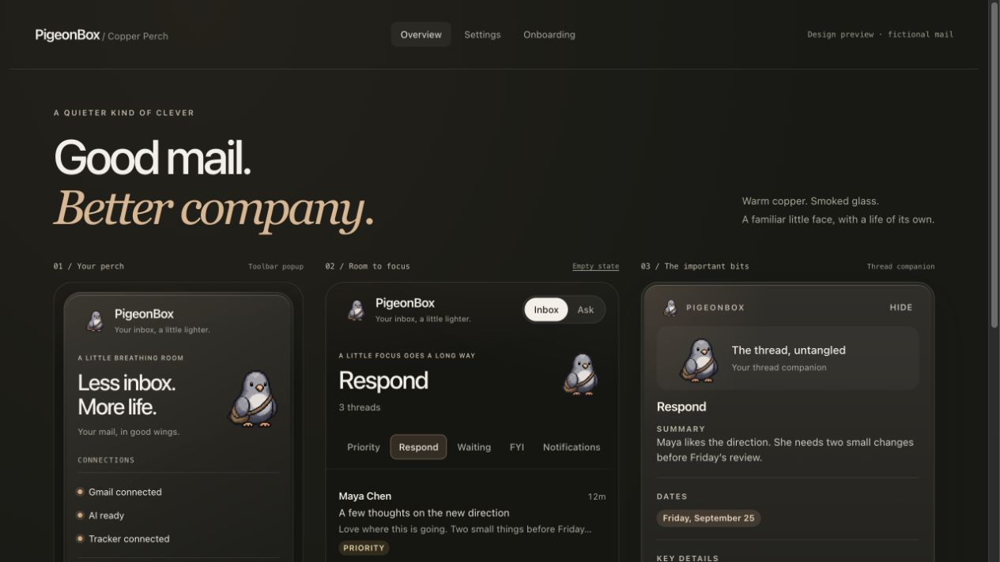
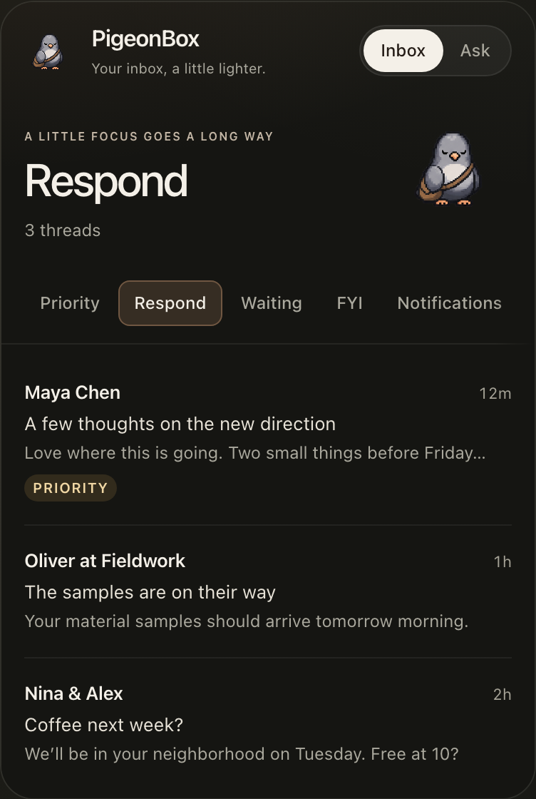
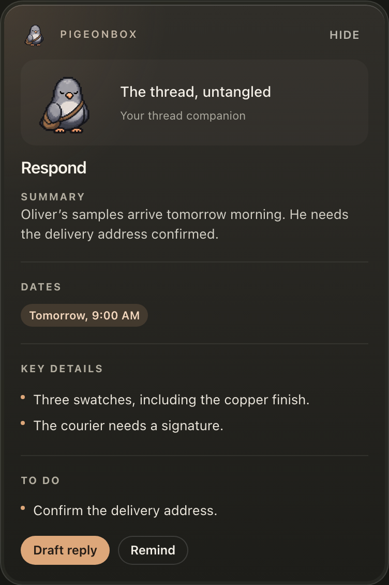
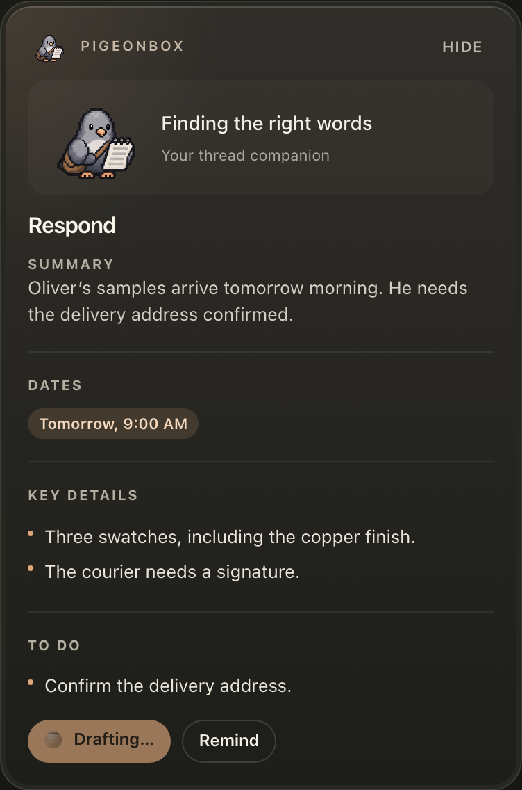
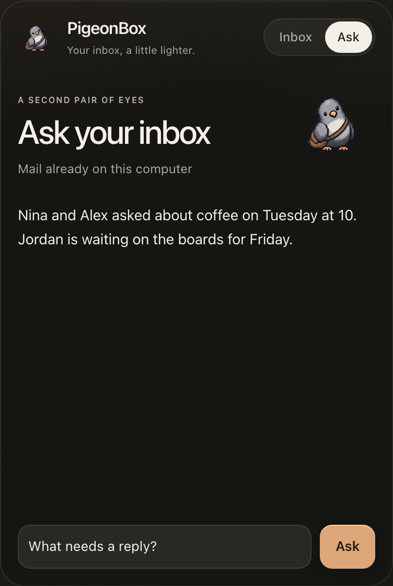
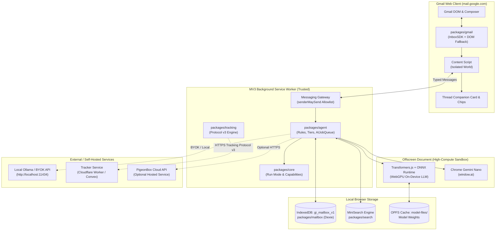

# PigeonBox

<p align="center">
  
</p>

<p align="center">
  <strong>Private, local-first email intelligence for Gmail.</strong><br>
  On-device AI triage, thread companion cards, voice-matched drafts, and privacy-preserving open tracking—without the Gmail API.
</p>

<p align="center">
  <a href="https://github.com/aiden-guan/pigeonbox/releases"></a>
  <a href="https://github.com/aiden-guan/pigeonbox/actions/workflows/ci.yml"></a>
  <a href="LICENSE"></a>
  <a href="#getting-started"></a>
</p>

<p align="center">
  <a href="https://github.com/aiden-guan/pigeonbox/releases">Releases</a> ·
  <a href="#core-capabilities">Capabilities</a> ·
  <a href="#architecture">Architecture</a> ·
  <a href="#engineering-deep-dives">Engineering Deep Dives</a> ·
  <a href="#getting-started">Quick Start</a> ·
  <a href="docs/architecture.md">Technical Docs</a>
</p>

<br>

<p align="center">
  
</p>

---

## Overview

PigeonBox is a Chrome extension (Manifest V3) that provides on-device email organization, thread summarization, draft generation, and open tracking directly inside Gmail. It does not require a cloud backend, does not request Gmail API OAuth scopes, and by default never transmits email contents off your computer.

All indexing, search, rule evaluation, and model inferences execute locally through browser primitives: IndexedDB, WebGPU (via Transformers.js and ONNX Runtime Web), Chrome's built-in Gemini Nano (`window.ai`), or a local Ollama instance. For teams seeking hosted convenience, PigeonBox also offers an optional Cloud mode backed by typed API contracts and strict zero-fallback privacy boundaries.

---

## Local vs. Cloud

PigeonBox provides two execution environments within a single extension package, selectable under **Settings → How should PigeonBox run?**:

| Feature / Dimension | On This Computer (Local) | PigeonBox Cloud |
| :--- | :--- | :--- |
| **Account Requirement** | None (100% anonymous) | PigeonBox account (OAuth + PKCE) |
| **Pricing** | Free, open-source (MIT) | Hosted subscription |
| **Inference Engine** | WebGPU (Transformers.js), Gemini Nano, Ollama, or BYOK | Hosted cloud inference cluster |
| **Email Content Boundary** | Remains on this machine (or configured local model) | Processed in-memory over TLS; never stored or logged |
| **Search & Mailbox Index** | Local IndexedDB (`gi_mailbox_v1`) | Local IndexedDB (`gi_mailbox_v1`) |
| **Open & Click Tracking** | Optional self-hosted (in-memory, Cloudflare, Convex) | Hosted managed tracker |
| **Network Resilience** | Fully functional offline | Requires connectivity; switch to Local at any time |
| **Fallback Guarantee** | Deterministic local evaluation | **Zero silent fallback** (never leaks payloads to third parties) |

Local mode is a complete, self-contained product. Cloud mode provides managed convenience without sacrificing data boundaries. If Cloud connectivity is interrupted, PigeonBox surfaces an explicit error rather than silently rerouting mail to third-party endpoints.

---

## Core Capabilities

| Inbox Triage & Categorization | Thread Companion Card & Action Items |
| :---: | :---: |
|  |  |
| Automatically sorts threads into Respond, Waiting, FYI, and Follow-ups using plain-language rules. Operates via on-device heuristics even when AI inference is disabled. | Draggable and resizable companion card floating inside Gmail threads. Surfaces structured summaries, action items, key dates, and open questions without leaving your view. |

| Voice-Matched Draft Generation | Ask Inbox with Citation Provenance |
| :---: | :---: |
|  |  |
| Generates context-aware replies matching the mailbox owner's tone and signature. Drafts are injected into Gmail's native composer; PigeonBox **never automatically sends mail**. | Natural-language query interface across locally indexed threads using MiniSearch hybrid retrieval. Provides direct citations and explicitly discloses partial index coverage. |

---

## Architecture

PigeonBox separates untrusted webpage DOM manipulation from trusted state and intelligence orchestration using Manifest V3 isolated contexts.



### Execution Flow

1. **Thread Lifecycle Detection**: When opening an email in Gmail, `packages/gmail/src/InboxSdkAdapter.ts` (or `DomFallbackAdapter.ts`) intercepts the thread view and extracts thread metadata.
2. **Context-Grounded Message Ingestion**: The content script packages thread text and dispatches typed `INGEST_THREAD` messages through the background message gateway (`apps/extension/src/background/messaging.ts`).
3. **Local Indexing**: `packages/mailbox/src/index.ts` stores thread records in IndexedDB (`gi_mailbox_v1` Dexie schema v4) and updates the lexical search index (`packages/search/src/search.ts`) for instant citation retrieval.
4. **Guarded Inference Dispatch**: `apps/extension/src/background/intelligence.ts` checks `@pigeonbox/core` capabilities. Local inference routes to WebGPU in an offscreen document or local endpoints (`http://localhost:11434`). Cloud requests validate through `@pigeonbox/api-contract` Zod schemas.
5. **UI Rendering & Draft Injection**: Summaries, key dates, and drafted replies return to `apps/extension/src/content/thread-panel.tsx`. Generated drafts inject directly into Gmail's native compose window for manual user review and approval.

---

## Engineering Deep Dives

### 1. One-Shot Claims Protocol for Sender Self-Open Suppression

- **Problem**: When a sender views an email in their Sent folder, Gmail's caching image proxy (`ci3.googleusercontent.com/proxy/*`) fetches the tracking pixel asynchronously. Traditional email trackers suppress self-opens by ignoring pixel hits within a fixed timestamp window (e.g., 8 seconds post-send). However, if Gmail delays fetching the pixel until the user re-opens the thread days later, the proxy fetch arrives without timestamp correlation and triggers a false "Recipient opened email" notification. Conversely, wide timestamp windows swallow legitimate recipient opens that occur quickly.
- **Approach**: Built an exact-identity, one-shot claim lifecycle (`packages/tracking/src/lifecycle.ts`, `apps/extension/src/content/message-self-view.ts`, `workers/tracker/src/index.ts`). When the user views a sent thread in Gmail, the extension detects distinct render milestones (`expandedAt` and `loadedAt`), applies client-side priority deduplication (`MESSAGE_LOAD` > `MESSAGE_EXPANDED` > `ROW_INTERACTION`), and registers a short-lived (25-second) self-view claim via `TRACKING_SELF_VIEW` with exponential retries and deterministic idempotency (`selfViewEventId`). The tracking server atomically consumes the claim upon the proxy's pixel request, classifies it as `SELF_LIKELY`, and re-opens the window for subsequent recipient opens.
- **Why**: Eliminates false positives from delayed proxy fetches and reloads without suppressing legitimate recipient interactions.
- **Tradeoff**: Requires coordinated state handling between the content script, background worker, and tracking store (Cloudflare Worker, Convex, or in-memory dev store) over Tracking Protocol v3.

### 2. Multi-Context Privilege Boundaries in Manifest V3

- **Problem**: In Chrome Manifest V3, content scripts run inside the untrusted DOM environment of `mail.google.com`. If credentials (BYOK API keys, tracker tokens, or Cloud session tokens) were stored in unrestricted extension storage, malicious third-party scripts or untrusted email HTML could extract secrets via DOM inspection or `storage.onChanged` listeners.
- **Approach**: Enforced strict privilege separation across contexts (`apps/extension/src/background/messaging.ts`, `docs/threat-model.md`). Extension storage (`chrome.storage.local` and `.session`) is locked to `TRUSTED_CONTEXTS`. Content scripts receive only sanitized `PublicExtensionSettings` stripped of tokens. A central messaging gateway (`senderMaySend`) intercepts all incoming messages and rejects any privileged action (settings mutation, Cloud authentication, run-mode alterations, index resets, or downloads) originating from a content script.
- **Why**: Quarantines all sensitive credentials inside the background service worker while permitting the content script to perform necessary Gmail DOM mutations.
- **Tradeoff**: Content scripts cannot synchronously read user configuration and must await asynchronous message broadcasts from the worker upon initialization or settings updates.

### 3. Strict Run-Mode Boundaries with Zero Silent Fallback

- **Problem**: Hybrid email assistants frequently suffer from privacy leaks when cloud services fail: an unreachable hosted model triggers an automatic fallback to remote third-party APIs, inadvertently routing private email bodies across unapproved networks without user consent.
- **Approach**: Implemented strict capability isolation in `@pigeonbox/core` and `@pigeonbox/cloud-client`. Local capabilities are computed entirely from device settings and run independently of Cloud infrastructure. In Cloud mode, if the API endpoint becomes unavailable or returns an error, the provider halts immediately and returns an explicit, user-facing error message. Local heuristics continue sorting incoming mail, but no email content is redirected to external endpoints.
- **Why**: Guarantees deterministic privacy boundaries and compliance with enterprise security requirements.
- **Tradeoff**: Cloud users experience explicit downtime notifications during outages rather than automatic fallback, requiring an intentional toggle in settings to switch to Local execution.

### 4. Resilient Dual-Strategy Gmail Adapter Lifecycle

- **Problem**: Webmail DOM trees frequently mutate due to Google A/B testing and class obfuscation, causing single-strategy extensions to break abruptly. Furthermore, injecting multiple event listeners across client-side router transitions leads to memory leaks and duplicate handler execution.
- **Approach**: Implemented a composite adapter architecture (`packages/gmail/src/CompositeGmailAdapter.ts`, `InboxSdkAdapter.ts`, `DomFallbackAdapter.ts`, `selectors.ts`). Primary interactions bind through InboxSDK. If InboxSDK encounters unmounted views or unhandled routes (such as navigation on `#inbox`), the composite adapter degrades to pure DOM observation using a centralized selector registry. A strictly-once lifecycle manager tracks active handler instances with Symbol metadata, preventing registration stacking across view navigations.
- **Why**: Centralizing DOM selectors in a single file isolates maintenance to one mapping file, while SDK hooks provide rich thread metadata whenever available.
- **Tradeoff**: Maintaining dual DOM selectors alongside SDK adapters requires ongoing validation against Gmail web client updates.

---

## Technology Stack

### Client & Browser Runtime
- **Runtime**: Chrome Extension Manifest V3 (Service Worker, Content Script, Offscreen Document)
- **UI Framework**: React 18, Tailwind CSS, Lucide Icons, Vite
- **Gmail Surface Integration**: `@pigeonbox/gmail` (InboxSDK 2.2 + custom DOM Fallback Adapter)
- **Local Model Execution**: WebGPU via `@huggingface/transformers` and ONNX Runtime Web

### Intelligence & Agent Orchestration
- **Agent Framework**: `@pigeonbox/agent` (Plain-language rule engine, safety-tiered job queue, and fingerprinting)
- **Provider Layer**: `@pigeonbox/ai` (`AIProvider` interface, prompt engineering, on-device model catalog)
- **Protocol Contract**: `@pigeonbox/api-contract` (Typed Zod protocol schemas, route definitions, and error codes)
- **Cloud Client**: `@pigeonbox/cloud-client` (Fetch client with PKCE authentication and capability negotiation)

### Persistence & Search Engine
- **Primary Mailbox Store**: `@pigeonbox/mailbox` (IndexedDB schema v4 via Dexie.js)
- **Full-Text Retrieval**: `@pigeonbox/search` (MiniSearch lexical indexing and hybrid citation retrieval)
- **Model Storage**: Origin Private File System (`OPFS`) for quantized model weights

### Tracking & Backend Infrastructure
- **Tracking Engine**: `@pigeonbox/tracking` (Protocol v3 classification: `RECIPIENT_LIKELY`, `SELF_LIKELY`, `MACHINE_LIKELY`)
- **Worker Tracker**: `workers/tracker` (Cloudflare Worker with in-memory dev store or Supabase Postgres backend)
- **Convex Tracker**: `convex/` (Optional serverless tracking backend)

---

## Getting Started

### Prerequisites
- [Node.js](https://nodejs.org) 20.0.0 or higher
- Google Chrome (or Chromium-based browser)

### Quick Start

1. **Clone and run the automated setup**:
   ```bash
   git clone https://github.com/aiden-guan/pigeonbox.git
   cd pigeonbox
   npm run setup -- --open
   ```

   The `setup` script validates your environment, installs workspace dependencies, creates a safe local `.env` with a generated personal token, builds all packages, and opens `chrome://extensions` alongside the output directory.

2. **Load the extension in Chrome**:
   - Navigate to `chrome://extensions`.
   - Enable **Developer mode** in the top-right corner.
   - Click **Load unpacked** and select `apps/extension/dist`.

3. **Open Gmail**:
   - Navigate to [https://mail.google.com](https://mail.google.com).
   - Click the PigeonBox icon in the extension toolbar or side panel to configure your preferred execution mode (Local on-device, Ollama, BYOK, or PigeonBox Cloud).

### Development & Verification

```bash
# Rebuild extension on file changes
npm run dev

# Run Vitest test suite across all packages (35 test files)
npm test

# Run full CI verification pipeline (hygiene, typecheck, lint, tests, build, release packaging)
npm run verify
```

---

## Self-Hosting

PigeonBox email tracking is optional and completely self-hostable. Mail triage, summarization, drafting, and search do not require a tracking server.

| Option | Command / Reference | Use Case |
| :--- | :--- | :--- |
| **Local In-Memory Tracker** | `npm run tracker` | Local testing on `http://127.0.0.1:8787`. Resets when stopped. |
| **Cloudflare Worker + Supabase** | [docs/self-hosting.md](docs/self-hosting.md) | Production serverless tracker running on Cloudflare Workers. |
| **Convex Tracker** | [docs/convex-self-hosting.md](docs/convex-self-hosting.md) | Zero-maintenance backend running on Convex. |

Configure tracking endpoints in the extension under **Settings → Email Tracking**.

---

## Repository Structure

```text
.
├── apps/
│   └── extension/             # Manifest V3 Chrome Extension (Vite, React 18, Tailwind)
│       ├── src/background/    # Service worker (messaging gateway, intelligence routing)
│       ├── src/content/       # Gmail content script and companion card UI
│       ├── src/offscreen/     # WebGPU and on-device model inference environment
│       └── src/settings/      # Extension settings, run-mode configuration, diagnostics
├── packages/
│   ├── agent/                 # Rule engine, safety tiers, AIJobQueue, and classification
│   ├── ai/                    # AIProvider interface, local model catalog, prompt templates
│   ├── api-contract/          # Typed PigeonBox Cloud protocol schemas (Zod)
│   ├── cloud-client/          # HTTP client for PigeonBox Cloud and PKCE authorization
│   ├── core/                  # Run mode state machine (Local vs. Cloud) and capabilities
│   ├── gmail/                 # Dual-strategy Gmail adapters (InboxSDK + DOM fallback)
│   ├── mailbox/               # Local IndexedDB persistence layer (Dexie schema v4)
│   ├── search/                # MiniSearch lexical search and hybrid RAG retrieval
│   ├── shared/                # Common schemas, crypto fingerprints, settings migration
│   └── tracking/              # Protocol v3 email tracking engine and event classification
├── workers/
│   └── tracker/               # Self-hostable Cloudflare Worker open/click tracking service
├── convex/                    # Optional zero-config tracking backend on Convex
├── docs/                      # Architectural specs, threat models, and self-hosting guides
└── scripts/                   # Verification (verify.mjs), packaging, and hygiene checks
```

---

## Privacy & Threat Model

| Data Category | Storage Location | Access Controls |
| :--- | :--- | :--- |
| **Email Text & Indices** | IndexedDB (`gi_mailbox_v1`) | Restricted to browser profile; never synced without explicit Cloud mode. |
| **Local AI Prompts** | On-device memory | Evaluated via WebGPU, Gemini Nano, or local Ollama; never transmitted externally. |
| **Cloud AI Prompts** | Ephemeral memory over TLS | Processed in-memory in PigeonBox Cloud; raw content is not stored or logged. |
| **Tracking Records** | Self-hosted backend / Cloud | Metadata only (event timestamps, user agent); never captures email bodies. |
| **Credentials & Tokens** | Extension Service Worker | Storage scoped to `TRUSTED_CONTEXTS`; never exposed to page scripts or DOM. |

- **Strict Zero-Auto-Send Guarantee**: PigeonBox inserts drafts into Gmail's composer for manual inspection. No automated path exists to send, delete, or mark emails as spam without direct user interaction.
- Full threat modeling and trust boundaries are detailed in [docs/privacy-model.md](docs/privacy-model.md) and [docs/threat-model.md](docs/threat-model.md).

---

## Limitations & Boundaries

- **Gmail Interface Evolution**: Gmail updates DOM layouts and CSS classes periodically. While PigeonBox uses InboxSDK and a centralized selector fallback registry, upstream Google changes may require adapter updates.
- **Index Coverage**: PigeonBox indexes email as threads are loaded or explicitly selected for ingestion. The Ask Inbox interface discloses when search queries span partially indexed mailboxes.
- **Open Tracking Nature**: Email open tracking is a probabilistic signal rather than definitive proof. Image blocking, VPNs, and Apple Mail Privacy Protection can suppress or simulate pixel loads. PigeonBox reports "Open detected", never "Read".
- **On-Device Model Constraints**: Quantized WebGPU models are optimized for factual extraction, categorization, and concise draft replies. Complex multi-step reasoning benefits from local Ollama or BYOK endpoints.

---

## Contributing

Contributions are welcome. Please read [CONTRIBUTING.md](CONTRIBUTING.md) for local workflow instructions and architectural guidelines. All pull requests must pass the automated verification suite:

```bash
npm run verify
```

To report security vulnerabilities, please refer to [SECURITY.md](SECURITY.md).

---

## License

This project is licensed under the [MIT License](LICENSE).
